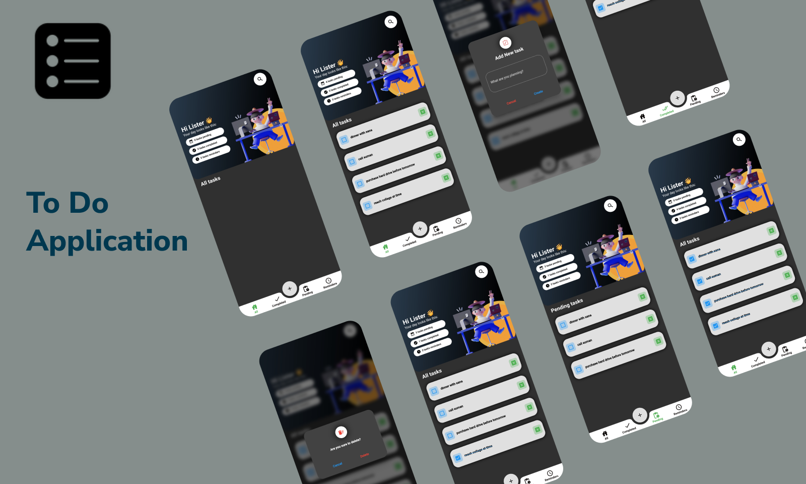

# Flutter Todo App

A simple TODO APP implemented using Flutter, powered by Riverpod as the state management solution, and utilizing Isar and Hive as local databases. This project is not completed yet, as soon as possible when it's complete I will update it here. Stay tuned for more exciting updates!

## Features

- [x] Task creation.
- [x] Task editing.
- [x] Task deletion.
- [x] Task completion tracking.
- [x] Local database (Hive)
- [x] Custom search bar
- [x] Custom Bottom navigation bar
- [ ] Sync across devices.
- [ ] Customizable labels and tags.
- [ ] Customizable settings.

and much more...
Check it yourself :)

## Screenshots

  

## Packages we are using:

Package | Usage
------------ | -------------
[hive](https://pub.dev/packages/hive) | Lightweight and blazing fast key-value database written in pure Dart.
[uuid](https://pub.dev/packages/uuid) | Generator and Parser for all Dart platforms.
[riverpod](https://pub.dev/packages/riverpod) | A simple way to access state from anywhere in your application.
[google_fonts](https://pub.dev/packages/google_fonts) | A Flutter package to use fonts from fonts.google.com.
[stylish_bottom_bar](https://pub.dev/packages/stylish_bottom_bar) | A collection of stylish bottom navigation bars.

## Design
- [Figma](https://www.figma.com/community/file/1124394532783501567)

## Contribute

Contributions are welcome.

## Facing any Issue?

Feel free to open an Issue :)

# Flutter SDK
Version 3.10
